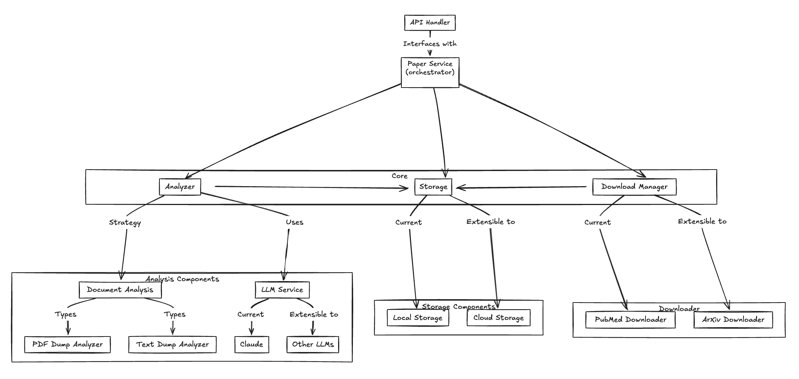
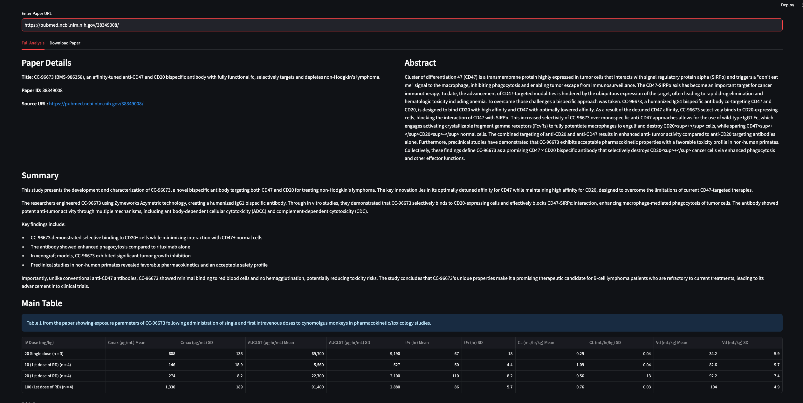

# Pubmed Paper Analyzer
A tool to get pubmed papers and summarize them - get summary, tables, etc.

# Limitations
- Only supports papers with pmcid(pubmed central id). 199/294 papers provided. 
- Although the context window size is not an issue, rate limits for LLMs are not handled currently. Ran into an issue with claude for large papers - 40k Tokens per minute allowed for basic tier.


# Approach

## Analysis
- Downloaded and analysed the papers listed in assignment to get a rough idea about the size and page count for average paper.
    - Successfully downloaded: 199(294 total)
    - Size distribution:
        - Largest: 34 MB (https://pubmed.ncbi.nlm.nih.gov/38798673/), 93 Pages 😱
        - Average: 5.6 MB
        - The size is mostly large due to inlcusion of images/figures/charts.
    - Page Count distribution:
        - 
        - Max: 93 (https://pubmed.ncbi.nlm.nih.gov/38798673/)
        - Median:16 
        - Over all papers, avg. number characters per page including spaces: ~4450    

## Requirements for our app
- Support upto 100 page research paper  - this should cover most of the papers 
- How many parallel requests do we need to support?
    - We would be bounded by the memory so the goal is to maximize the number of parallel requests for a given memory.
    - Download direct to storage, so memory is not an issue.
    - Assuming rate limits are high enough for both the LLMs and the pubmed api(3 per second without api). 

- Minimising cost:
    - keep the number of tokens to a minimum.


## Assumptions
- LLMs have a context window of 128k tokens. True for gpt, claude, gemini, etc.
    - assuming(as analysis showed) 4450 characters per page ~= 1000 tokens per page.
    - so, 128k tokens / 1000 tokens ~= 128 pages.
- Rate limits are high enough for both the LLMs and the pubmed api
    - *current pubmed api allows 3 requests per second* - going to assume that this would be enough for our use case.

## Analysis algorithms
- Directly send the entire paper to the LLM as pdf
    -  Some LLMs support pdf input, claude(max 100 pages, 32MB)(https://docs.anthropic.com/en/docs/build-with-claude/pdf-support)  
    -  Cons:
        - More tokens to be processed, image based cost(2x).
        - Could be slow as we need to send the entire pdf which could be large.
    -  Pros:
        - simple to implement, no more pdf parsing.

- Send the entire txt content of the pdf to the LLM
    - Parse the pdf using a library(pymupdf) and send the entire txt content to the LLM.
    -  Pros:
        - less tokens compared to pdf.
    -  Cons:
        - parsing pdf would lose the layout, could be less accurate for tables.

- Hybrid approach (to be implemented)
    - Send the entire txt content of the pdf to the LLM with Page Numbers.
    - Ask the LLM about the specific page number with the main table.
    - Pass the image of the page with the table to the LLM.

# Design



## Paper Service Component
- For orchestrating the complete flow of getting the paper, analyzing it and storing it.

## Downloader Component
- For downloading the pdf of the paper. Only supports papers with pmcid(pubmed central id). 
- rate limited to 3 requests per second by pubmed api.

## Analyzer Component
- Responsible for doing the analysis of the paper - getting summary, tables etc.
- 2 types of analyzers:
    - PdfDumpAnalyzer
        - send the entire pdf to the LLM.
    - TextDumpAnalyzer  
        - parse the pdf using a library(pymupdf) and send the entire txt content to the LLM.

## Storage Component
- For storing the pdf, txt content, etc.
- Local storage for now.

## Identifier Component
- For generating unique ids for the papers. Currently using the pubmed id.

## LLM Component
- For interacting with the LLMs.
- Currently supports claude and openai.


# Logging and Error Handling
- Global logger, logging at the source where the error occurs.
- Error handling: same, raised at source. One global exception handler to log the error and reraise it.

# Setup instructions
- clone the repo
- python version <3.12 (biopython dependency supports only upto 3.11)(using mac? `brew install python@3.11`)
- create a virtual environment and install the dependencies using `pip install -r requirements.txt`
- setup the environment variables, .env in root directory. Add "CLAUDE_API_KEY"/"OPENAI_API_KEY". The app would check if openai api key is present, if not then it would use claude.

# Usage
Update the .env file with the API key for claude/openai. 
Update the model getting used in main.py file.
The results are saved in the `data` directory.

## Streamlit UI
- run frontend `python streamlit run app.py`
- backend server `python main.py`


## Using API
- Endpoints, 
    - `POST /get-analysis` - to get the summary of the paper.
    - `GET /get-metadata` - to get the metadata of the paper.
    - `GET /download` - to download the pdf of the paper.
```
curl -X POST \
  http://localhost:8000/get-analysis \
  -H 'Content-Type: application/json' \
  -d '{
    "url": "https://pubmed.ncbi.nlm.nih.gov/39327512/"
  }'
```

## Libraries used 
- [!pymupdf](https://pymupdf.readthedocs.io/en/latest/) - to parse the pdf.
- [!biopython](https://biopython.org/wiki/Download) - to download and parse pubmed papers.
- [!requests](https://requests.readthedocs.io/en/latest/) - to make http requests.
- [!anthropic](https://docs.anthropic.com/en/docs/build-with-claude/python) - to use claude api.
- [!streamlit](https://docs.streamlit.io/en/stable/getting_started.html) - to build the UI.
- [!pydantic](https://docs.pydantic.dev/latest/) - to define data models used for structured outputs.
- [!fastapi](https://fastapi.tiangolo.com/) - to build the api.


# Example Results
Results are saved in the `data` directory. Below are screenshots of the results as shown in the streamlit UI.

## Paper: [https://pubmed.ncbi.nlm.nih.gov/39040441](https://pubmed.ncbi.nlm.nih.gov/39040441)


## Paper: [https://pubmed.ncbi.nlm.nih.gov/38241836](https://pubmed.ncbi.nlm.nih.gov/38241836)


## Paper: [https://pubmed.ncbi.nlm.nih.gov/38285791](https://pubmed.ncbi.nlm.nih.gov/38285791)


## Paper: [https://pubmed.ncbi.nlm.nih.gov/38349008](https://pubmed.ncbi.nlm.nih.gov/38349008)


## Paper: [https://pubmed.ncbi.nlm.nih.gov/38805560](https://pubmed.ncbi.nlm.nih.gov/38805560)


